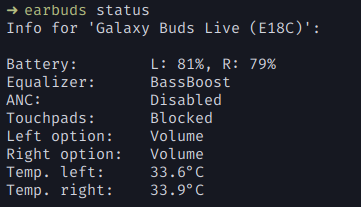

[](https://github.com/JojiiOfficial/LiveBudsCli/actions?query=workflow%3ARust)
[](https://crates.io/crates/earbuds)
[](https://aur.archlinux.org/packages/earbuds/)
[](https://aur.archlinux.org/packages/earbuds-git/)

# LiveBudsCli
A free cli tool to control your [Galaxy buds live](https://www.samsung.com/us/mobile-audio/galaxy-buds-live), [Galaxy Buds+](https://www.samsung.com/us/mobile/audio/galaxy-buds-plus/), [Galaxy Buds Pro](https://www.samsung.com/us/mobile/audio/galaxy-buds-pro/), [Galaxy Buds 2](https://www.samsung.com/us/mobile-audio/galaxy-buds2/) and [Galaxy Buds 2 Pro](https://www.samsung.com/us/mobile-audio/galaxy-buds2-pro/)

`Note: This requires your buds to be up to date. Buds with old firmware aren't supported`

<table>
<tr>
    <td>
        
    </td>
    <td>
        
    </td>
</tr>
</table>
<br>


# Features
- [x] Equalizer, touchpad-lock and anc/ambient sound control
- [x] Basic Buds status (battery, anc/ambient sound, current equalizer setting, ...)
- [x] Changing touchpad tap action
- [x] Advanced status informations (battery voltage/current, temperature)
- [x] Auto music play/pause on bud remove (via mpris)
- [x] Automatic sink switch (pulseaudio) [feature: `pulse-sink`, used by default]
- [x] Desktop notifications (for low battery)
- [x] Bash completion (for every shell)
- [x] Connect/Disconnect your earbuds easily with a subcommand
- [x] Multiple device support
- [x] Individual device configs
- [x] Json output for scripts (via `jq`)
- [x] Change config options from cli

# Install

## AUR
`yay -S earbuds`

## Compilation
#### Requirements (make depends)
Arch: bluez-libs libpulse dbus <br>
Fedora: dbus-devel bluez-libs-devel
<br>

Run following command:
```
cargo install earbuds
```


# Polybar

<br>
You can display the status of your buds in your polybar with [this script](https://github.com/JojiiOfficial/LiveBudsCli/tree/master/scripts/polybar.sh)
<br>
To achieve this, you have to add following to your polybar config and move the script into your polybar script folder. Don't forget to add `buds` to the modules section.
```
[module/buds]
type = custom/script
interval = 8
label = %output%
exec = ~/.config/polybar/scripts/polybar.sh
click-middle = earbuds toggle anc
click-right = earbuds toggle touchpadlock
```


# Usage
To get most of the features listed above, you need to have a daemon instance running (`earbuds -d`). If you run one of the commands 
listed below, the daemon automatically gets started.

Status informations:
```
earbuds status
```

Set equalizer to Bass boost
```
earbuds set equalizer bass
```

Enable ANC
```
earbuds enable anc
```

Change ambient sound
```
earbuds set ambientsound <0-4> # 0: off 4: highest
```

Toggle noise reduction or the touchpad lock
```
earbuds toggle anc/touchpad
```

Get status in json format
```
earbuds status -o json
```
Set the left touchpad tap command to spotify
```
earbuds set tap-action spotify left
```

Connect/disconnect:
```
earbuds connect/disconnect
```

To debug the daemon run:
```
earbuds -k -d --no-fork
```
This kills the currently running daemon, creates a new one and starts it in the foreground.
